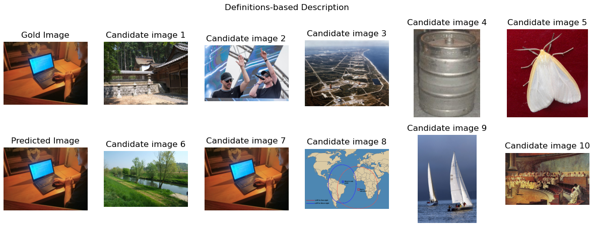

# Visual Word Sense Disambiguation

This project provide a solution for thw Visual Word Disambiguation Task (VWDT).

## Description

### Dataset
The dataset used in this project is the Test-set provided in the [Task 1 of the SemEval-2023 competition](https://raganato.github.io/vwsd/).
The dataset contains 968 entries in three languages: English (463), Italian (305) and Farsi (200) with the following structure: ```target word,
full phrase, image 1, ..., image 10, gold image```. 


### Idea 
The idea of this solution is to provide a more complete **description** of the ```target image``` starting from the ```full phrase```. The description is created using [WordNet](https://wordnet.princeton.edu/) with two methods:
- synsets-based method: compute the description starting from the synsets of the words in the full-phrase;
- definitions-based method: compute the description starting from the definitions of the words in the full-phrase.

The encoding of images and texts are done using [CLIP](https://github.com/openai/CLIP) (OpenAI).


### Dataframes

In the folder Datasets are provided the .csv files with the translated versions of Italian and Farsi entries (using the Google Translator from [deep_translator](https://pypi.org/project/deep-translator/) library) and the descriptions of the target image. 


## Visuals

- Target-word: navigate
- Full-phrase: navigate the web
- Description (definition-based): network internet resource graphic direct text suggest intricate (description-weight: 0.87)

   

For a more complete list of visual results refer to the presentation slides of the project.

## Results

### Synsets-based solution

The results of the synsets-based solution are:

| Translation        | False | False | True  | True  |
|--------------------|-------|-------|-------|-------|
| Description        | False | True  | False | True  |
| English accuracy   | 0.5745| **0.5918** | 0.5745| **0.5918** |
| Italian accuracy   | 0.1836| 0.2787| **0.5311** | **0.5311** |
| Farsi accuracy     | 0.0950| 0.2300| **0.5150** | 0.4550|
| Weighted Accuracy  | 0.3523| 0.4184| **0.5486** | 0.5444|


### Definition-based solution

The results of the definitions-based solution are:

| Translation       | False  | False           | True            | True       |
|-------------------|--------|-----------------|-----------------|------------|
| Description       | False  | True            | False           | True       |
|                   |        |                 |                 |            |
| English accuracy  | 0.5745 | **0.6112**      | 0.5745          | **0.6112** |
| Italian accuracy  | 0.1836 | 0.2754          | **0.5311**      | 0.5115     |
| Farsi accuracy    | 0.0950 | 0.2350          | **0.5150**      | 0.5000     |
|                   |        |                 |                 |            |
| Weighted Accuracy | 0.3523 | 0.4277          | 0.5486          | **0.5568** |


